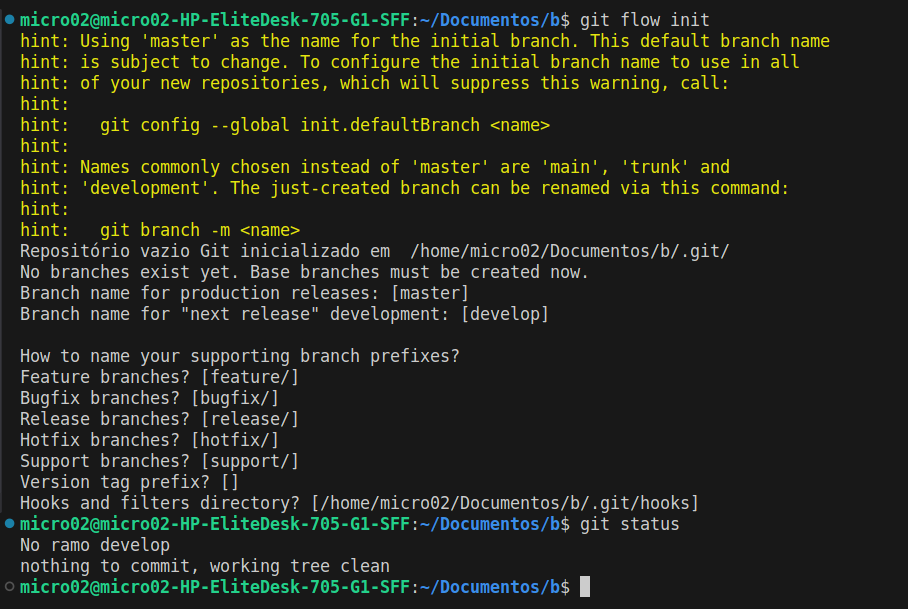

'### Iniciando um rep GitFlow

https://danielkummer.github.io/git-flow-cheatsheet/

https://www.gitkraken.com/learn/git/git-flow

https://imasters.com.br/agile/fluxo-de-desenvolvimento-com-gitflow

https://medium.com/trainingcenter/utilizando-o-fluxo-git-flow-e63d5e0d5e04


Para iniciar um repositório GitFlow, pode-se pegar um repositório git já criado ou de uma pasta não iniciada no git e digitar o seguinte comando bash:

```
git flow init
``` 
Este comando irá iniciar o repositório no GitFlow onde será possível realizar algumas configurações iniciais dos nomes das branchs que serão usadas como pode ser visto abaixo.



Ao ser inicializado o git flow, criará a branch master e a develop e ja te colocará na branch develop.

Aqui será onde o trabalho desenvolvido será armazenado.

Para iniciar um feature basta usar o comando:

```
git flow feature start [NomeDaFeature]
```


Uma branch ``Feature/[NomeDaFeature]`` será criada e você será jogado nela.
Após realizar o trabalho, basta dar :

```
git add .
git commit -m "Seu commit"
```

Caso ainda haja algum trabalho a ser feito, a feature pode ser publicada com o comando ;

```
git flow feature publish [NomeDaFeature]
```

Ao concluir a feature basta finaliza-la com o comando:

```
git flow feature finish [NomeDaFeature]
```

Será solicitado a adição de uma explicação do trabalho realizado, como um commit explicando o motivo do merge.
Finalizando você voltará para a develop atualizada com a feature que foi finalizada.


###Importante!!!

Com vários utilizadores, é importante que sua develop esteja atualizada, para isso, dentro da develop use os comandos:


```
git fetch
git pull origin develop
```
*Caso não esteja nela, apenas use `git checkout develop`* e os comandos acima.

Esse comando irá atualizar a develop, em seguida pode dar checkout para a sua feature e publica-la ou finaliza-la sem mais problemas.